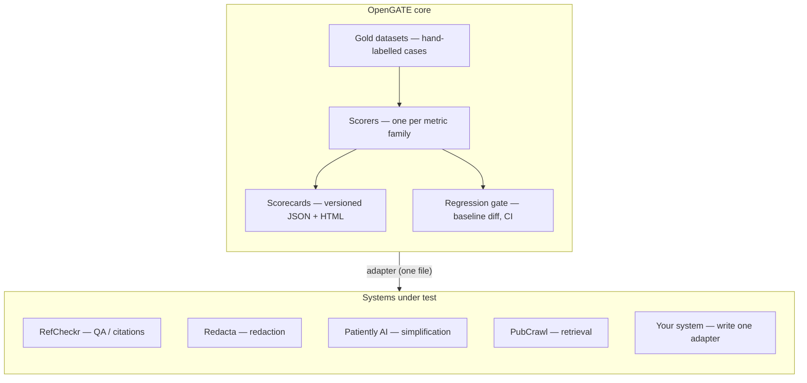
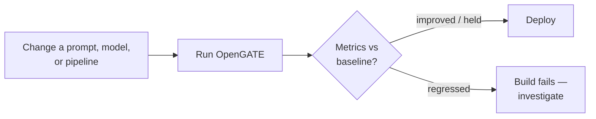

<div align="center">

# OpenGATE

### Open Grounded AI Testing & Evaluation

**Deterministic, gold-anchored evaluation for evidence-grounded AI — no LLM judge.**

[](https://github.com/nickjlamb/opengate/actions/workflows/ci.yml)
[](https://www.npmjs.com/package/@pharmatools/opengate)
[](https://pypi.org/project/opengate-grounding/)
[](https://hub.docker.com/r/pharmatools/opengate)
[](https://nodejs.org)
[](LICENSE)
[](CONTRIBUTING.md)

[Quick start](#quick-start-60-seconds) · [Architecture](#architecture) · [Surfaces](#one-check-many-surfaces) · [Examples](examples/) · [Roadmap](docs/ROADMAP.md) · [Contributing](CONTRIBUTING.md) · [Changelog](CHANGELOG.md)

</div>

---

**Evidence over plausibility.** OpenGATE evaluates AI systems that must justify every answer from source material — RAG pipelines, document-QA tools, legal and scientific assistants. It measures one thing above all: **can the system prove its answer from the evidence it was given?**

The check is **deterministic** — no LLM-as-judge, no grader model, no six-point verdict scale. Required facts must be present, every number must trace back to the source, and when the context can't answer, the system must abstain rather than fabricate. Because it's pure logic, it's reproducible, free, and fast enough to run on every answer or gate on every commit.

> As AI moves into high-stakes domains, evaluation is becoming as fundamental as automated testing is in traditional software. OpenGATE turns grounding failures into numbers you can track, and gates every prompt, model, or workflow change against a baseline — so reliability can't quietly regress.

## Quick start (60 seconds)

No API key needed — the offline suite runs deterministic scorers against the bundled gold set:

```bash
npx @pharmatools/opengate           # run the offline evaluation suite
npx @pharmatools/opengate init      # scaffold gold cases + HTTP config + a GitHub Action
```

```
OpenGATE — 39 case(s), online=false, adapter=refcheckr

  ✓ citation-detection   PASS
      perClaim_exactSetRate      100.0%
      perClaim_jaccardMean       100.0%
      supportedStyle_accuracy    100.0%
  ⊘ grounding            SKIPPED — online scorer (pass --online)
```

Point `opengate.http.json` at your endpoint and add `--online --ci` to gate your own system. Full walkthrough: **[Getting Started](docs/GETTING-STARTED.md)**.

## One check, many surfaces

The same deterministic grounding logic ships wherever your stack lives:

| Surface | Install | Use it for |
|---|---|---|
| **CLI + framework** | `npx @pharmatools/opengate` | Full eval suite, adapters, regression gate |
| **GitHub Action** | `uses: nickjlamb/opengate@v0` | Drop-in CI gate in any repo |
| **Python package** | `pip install opengate-grounding` | `check_grounding()`, pytest gate, [DeepEval](https://deepeval.com) metric |
| **MCP server** | `npx @pharmatools/opengate-mcp` | Agents that verify their own answers inline |
| **Docker image** | `docker run pharmatools/opengate` | CPU-only, containerised pipelines |

## Architecture



Scorers never talk to a system directly — they reach it through a small **adapter**, so the methodology travels and only the gold set changes. Where it sits in the development loop:



## Why not DeepEval?

Use both. General-purpose frameworks like DeepEval and OpenAI Evals evaluate AI systems broadly. OpenGATE specialises in systems whose core promise is *grounded* answers:

- **Provenance is first-class** — does the cited passage actually exist, verbatim, in the source?
- **No LLM judge** — scores are deterministic checks against hand-labelled gold, so they're reproducible and free to run in CI; your judgment lives in the gold set, not a grader model's.
- **Regression detection is first-class** — every run is diffed against a per-adapter baseline; a drop fails the build.

Pair a general framework for broad quality metrics with OpenGATE to gate the grounding.

## Core concepts

**Gold cases** — hand-labelled benchmark cases (`datasets/cases/`): source text, the claims that should be extracted, the sentences that should *not* be, and reference snippets with known-correct verdicts. Copy `_template.json` to add one; format in [`datasets/SCHEMA.md`](datasets/SCHEMA.md), labelling rules in [`datasets/LABELING-GUIDE.md`](datasets/LABELING-GUIDE.md).

**Scorers** — one module per metric family (`src/scorers/`):

| Scorer | Mode | Measures |
|---|---|---|
| `citation-detection` | offline | per-claim citation set exact-match & Jaccard; supported-style accuracy |
| `claim-extraction` | online | precision / recall / F1 vs gold; non-claim leakage; **fidelity** (claim is verbatim from source) |
| `verdict-accuracy` | online | exact & adjacency accuracy on a six-point scale; **passage hallucination rate**; consistency; latency & token cost |
| `redaction` | online | recall on gold identifiers with **leaks as named failures**; over-redaction; known-gap tracking |
| `simplification` | online | faithfulness of rewrites: **anchor recall** (critical facts survive), **fabricated numbers**, length gates |
| `retrieval` | online | fidelity of retrieved records vs the authority: **anchor fields** + structural invariants |
| `grounding` | online | generic RAG: **answer-anchor recall**, **fabrication** vs context, and **abstention**. The turnkey path |

Offline scorers run with no API key — fast enough for every commit. Online scorers exercise a live system through an adapter.

**Scorecards** — every run writes `results/<timestamp>.json` stamped with the git SHA, so any result is reproducible and auditable. Per-model runs carry a `run_model` label, turning the results directory into a measured comparison (accuracy × hallucination × latency × cost).

**Regression gate** — `--baseline` saves a reference; later runs print per-metric deltas (▲/▼ in percentage points) and `--ci` fails the build on any drop. Baselines are **per-adapter**, so one system's scorecard can't clobber another's.

**HTML report** — add `--report` (or `opengate report`) for a self-contained dashboard: pass/fail per scorer, deltas vs baseline, every named failure. One file, no server, no dependencies.

## Evaluating your own system

An adapter is one file: two base exports — `onlineAvailable()`, `onlineConfigHint()` — plus at least one complete **capability** (e.g. `grounding` → `answer()`). Scorers check `adapter.capabilities` and skip cleanly across the boundary; adapters are validated at load with messages naming every missing export.

```bash
OPENGATE_ADAPTER=./adapters/my-system.mjs npm run eval:online
```

For REST-backed systems there's a **no-code path**: the bundled generic HTTP adapter reads endpoint paths and headers from `opengate.http.json` (`${ENV}` interpolation, built-in latency/token capture). Full contract and a minimal skeleton: **[ADAPTERS.md](ADAPTERS.md)**.

## Examples

- [**Evaluating a NIM-powered RAG agent**](examples/nim-rag) — builds a RAG agent on an [NVIDIA NIM](https://build.nvidia.com) model and gates its answers' grounding with OpenGATE, deterministically and with no LLM judge. Includes a runnable Python notebook (`opengate-grounding`) and a Node adapter for the CI gate.

## Proven in production

Four PharmaTools products run on OpenGATE in CI — four different capability shapes, one evaluation standard. Run against RefCheckr's gold set, OpenGATE:

- surfaced a **silent parse-failure mode** affecting ~50% of multi-claim verdicts, eliminated with enforced structured output (→ 0);
- **halved passage hallucination** (5.8% → 2.4%) by driving a measured production model change — a decision made on numbers, not reputation;
- holds claim extraction at **~0.95 F1** with near-full recall.

<details>
<summary><b>Redacta</b> — redaction capability (proof the methodology isn't QA-shaped)</summary>

[Redacta](https://www.pharmatools.ai/redacta) wraps the `@pharmatools/redacta` engine, scored against synthetic UK clinical notes with gold-labelled identifiers. On its first run the eval found two real engine bugs (relation phrases swallowing nested names; apostrophe surnames dropped) — both fixed and confirmed (`knownGap_closed: 2`), then promoted to gold. Current scorecard: **100% recall on 25 gold identifiers, 0 leaks, no open gaps**.

```bash
npm install --no-save @pharmatools/redacta
node src/runner.mjs --online --adapter ./src/adapters/redacta.mjs
```
</details>

<details>
<summary><b>Patiently AI</b> — simplify capability (faithfulness of paraphrase)</summary>

[Patiently AI](https://www.pharmatools.ai/patiently-ai) exercises faithfulness scoring for text that is paraphrase by design. The eval caught the simplifier **dropping safety-critical specifics** — an antibiotic dose vanished from a discharge summary (anchor recall 86%). A preservation rule took the next run to **100% anchor recall, 0 dropped facts, 0 fabricated numbers**.

```bash
node src/runner.mjs --online --adapter ./src/adapters/patiently.mjs
```
</details>

<details>
<summary><b>PubCrawl</b> — retrieval capability (the layer everything else grounds on)</summary>

[PubCrawl](https://www.pharmatools.ai/pubcrawl) has **no model** — it exercises retrieval fidelity against hand-verified anchors and structural invariants, catching parser regressions (collapsed author arrays, `[object Object]` leakage) that would poison every downstream citation. That OpenGATE scores a non-AI system at all is the point: evidence-grounded AI is only as trustworthy as the retrieval beneath it.

```bash
node src/runner.mjs --online --adapter ./src/adapters/pubcrawl.mjs
```
</details>

Full methodology and model comparison: [how RefCheckr is evaluated](https://www.pharmatools.ai/refcheckr-eval).

## Project layout

```
opengate/
├── src/
│   ├── lib/          metrics + shared grounding core (single source of truth)
│   ├── scorers/      one file per metric family (7 scorers)
│   ├── adapters/     system-under-test boundary (refcheckr.mjs is the reference)
│   └── runner.mjs    CLI: discover cases → score → report → snapshot → gate
├── datasets/         gold-labelled cases (39) + fixtures + schema
├── examples/         worked examples (NVIDIA NIM RAG)
├── mcp/              MCP server (@pharmatools/opengate-mcp)
├── python/           opengate-grounding (PyPI) + DeepEval metric
├── Dockerfile        CPU-only image (pharmatools/opengate)
└── action.yml        GitHub Action
```

## Documentation

| Doc | What's in it |
|---|---|
| [Getting Started](docs/GETTING-STARTED.md) | Zero to a CI gate for a generic RAG system |
| [ADAPTERS.md](ADAPTERS.md) | The adapter contract + a minimal skeleton |
| [datasets/SCHEMA.md](datasets/SCHEMA.md) | Gold-case format |
| [Roadmap](docs/ROADMAP.md) | What's next, and the road to 1.0 |
| [Contributing](CONTRIBUTING.md) | Dev setup, adding cases/adapters/scorers, PR flow |
| [Changelog](CHANGELOG.md) | Release history |

## Contributing

Contributions are welcome — especially **gold cases** (new domains, citation styles), **adapters** (connect your system), and **scorers** (new metric families). See **[CONTRIBUTING.md](CONTRIBUTING.md)** — including its support & governance expectations and AI-assisted development disclosure; open an issue to discuss large changes. Interfaces may still shift pre-1.0, and semver will signal breaking changes.

## Citing OpenGATE

If you use OpenGATE in research, please cite it — citation metadata is in [`CITATION.cff`](CITATION.cff) (GitHub's "Cite this repository" button uses it).

## License

[MIT](LICENSE) — because evaluation frameworks shouldn't be black boxes. If an evaluation influences deployment decisions, engineers should be able to inspect every scorer, metric, and benchmark.

<div align="center">
<sub>Built by <a href="https://www.pharmatools.ai">PharmaTools.AI</a> · <a href="https://www.pharmatools.ai/opengate">opengate overview</a></sub>
</div>
